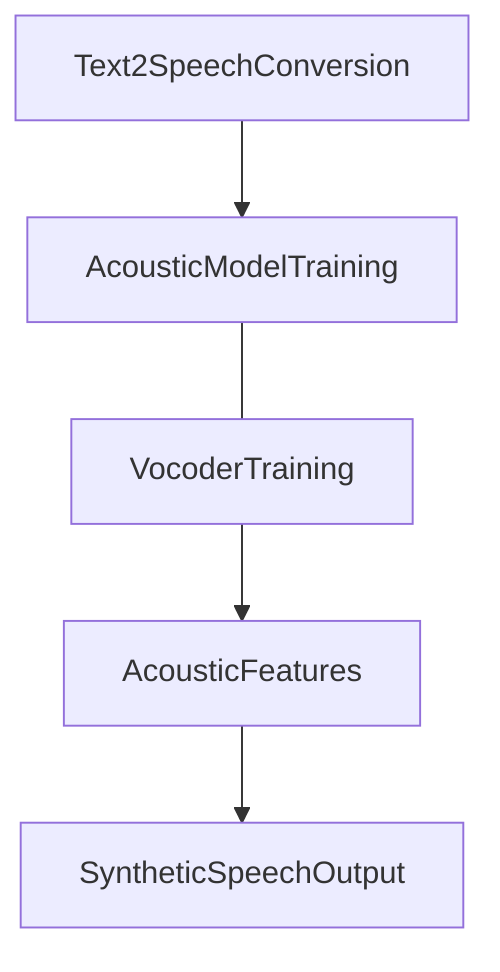

# Voice Cloning using coqui-TTS

## Finetuned [coqui-TTS](https://github.com/coqui-ai/TTS):

Voice cloning is the process of converting text input into natural and expressive synthetic speech using a pre-trained Text-to-Speech (TTS) model. In this project, I utilized the coqui-TTS model, which involves two main stages: Text and Audio Preprocessing and Acoustic Model Training. The text data undergoes tokenization and normalization, while the audio data is converted into Mel-frequency cepstral coefficients (MFCCs) or spectrograms. The acoustic model, typically implemented using neural networks like RNNs or transformers, learns the mapping between text representations and acoustic features. Finally, the vocoder synthesizes the acoustic features into high-quality waveforms, generating the desired speech output.


## Dataset Preparation:


For this project, I used a dataset consisting of 212 data points of Priyanka Chopra's voice notes and their corresponding transcriptions. The dataset was meticulously prepared in the following steps:


#### Dataset Structure:
```
/converted
 | - data-01.wav
 | - data-01.wav
 | - data-01.wav

/metadata.csv

  | - data-01|speaker|Dialogue 1.
  | - data-02|speaker|Dialogue 2.
  | - data-03|speaker|Dialogue 3.

```

## HyperParameters And Pretrained Model Weights:

To achieve the best results, we fine-tuned the coqui-TTS model using the following set of hyperparameters:

| HyperParameters Used
|--------------------------
| batch_size=16
| eval_batch_size=16
| num_loader_workers=4
| num_eval_loader_workers=4
| run_eval=True
| test_delay_epochs=-1
| epochs=200
| lr = 0.0005
| text_cleaner="phoneme_cleaners"
| use_phonemes= False
| phoneme_language="en-us"
| mixed_precision=True
| save_step=7000


## Results:

The following results were obtained by finetuning coqui-TTS model.

|  Average Loss |     Average Log MLE(Maximum Likelihood Estimation)               |        Average Loader Time |     
| ------------- | -------------                        | -------------           |
|    0.2887064963579178     |  -0.2587181031703949                     |     0.0015705227851867676              |


